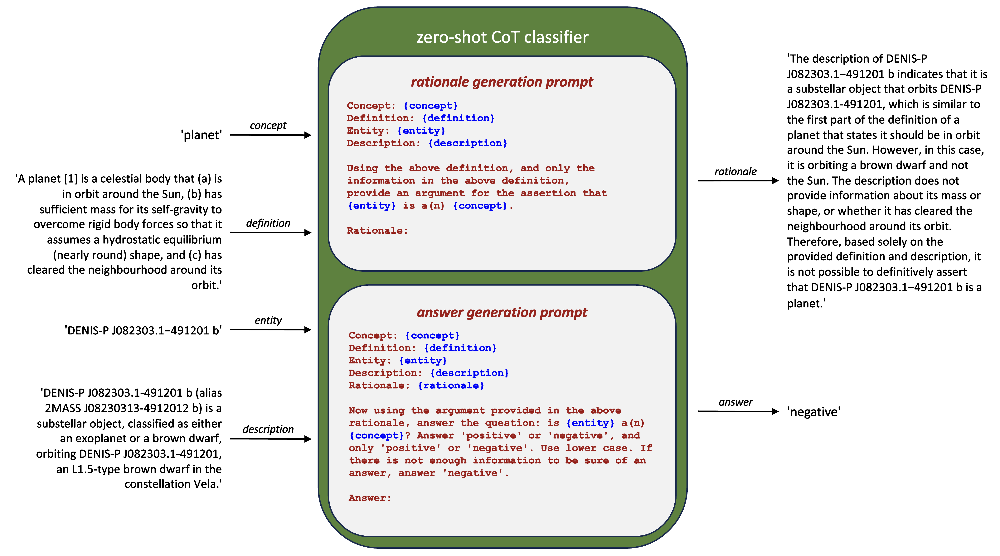

# zero-shot-classifiers-for-conceptual-engineering
 Experiments with conceptual engineering using an LLM-based implementation of Jennifer Nado's classification procedures.

## Overview
This repository contains code for using large language models to implement targets of conceptual engineering, and demonstrates it using data from Wikidata to evaluate concept definitions from two paradigmatic conceptual engineering projects: the International Astronomical Union's redefinition of PLANET and Haslanger's ameliorative analysis of WOMAN.

## Requirements
Python 3.11 or higher.

## Installation
```
$ git clone https://github.com/bradleypallen/zero-shot-classifiers-for-conceptual-engineering.git
$ cd zero-shot-classifiers-for-conceptual-engineering
$ pip install -r requirements.txt
```

## License
MIT.

## Background
*Conceptual engineering* (CE) is a philosophical methodology concerned with the assessment and improvement of concepts [1]. Koch, Löhr and Pinder have surveyed recent work on the theory of CE, discussing different theories defining the targets of CE, i.e., "*what* conceptual engineers are (or should be) trying to engineer" [2]. In one such theory, Nado proposes as targets *classification procedures*, defined as abstract 'recipes' which sort entities "into an 'in'-group and an 'out'-group" [3]. Our work builds on Nado's idea by defining a method for implementing classification procedures consistent with this definition. 

A *large language model* (LLM) is a probabilistic model trained on a natural language corpus that, given a sequence of tokens from a vocabulary occurring in the corpus, generates a continuation of the input sequence. LLMs exhibit remarkable capabilities for natural language processing and generation [4]. Our work uses *prompt engineering* [5] of LLMs to implement classification procedures. 

A *knowledge graph* represents knowledge using nodes for entities and edges for relations [6]. Knowledge graphs are key information infrastructure for many Web applications [7]. Our work leverages knowledge graphs as a source of entities used to evaluate classification procedures.

## Implementation
Figure 1 illustrates our method for implementing classification procedures as zero-shot chain-of-thought [8] classifiers. Given a concept's name and intensional definition and an entity's name and description, we prompt an LLM to generate a rationale arguing for or against the entity as an element of the concept's extension, followed by a final 'positive' or 'negative' answer.

|  | 
|:--:| 
| Figure 1. A classification procedure using the 24 August 2006 version of the IAU definition of PLANET, implemented as a zero-shot chain-of-thought classifier, and being applied to the description of the entity DENIS-P J08230313-491201 b. |

### [classification_procedure.py](classification_procedure.py)

## Experiments
To evaluate classification procedures built using this method, we sample positive and negative examples of a concept from the Wikidata collaborative knowledge graph [9], retrieving for each entity a summary of its Wikipedia page to use as its description. Next, we apply the classification procedure for a given definition of the concept to each example and compute a confusion matrix from the classifications, which provides performance metrics for the classification procedure. False positives/negatives are then reviewed to determine if a given error arises from the concept's definition or the entity's description.

All definitions are used verbatim. For the LLM, we use GPT-4 [10] with a temperature setting of 0.1.

### [planet_experiment.ipynb](planet_experiment.ipynb)
We evaluated three definitions for PLANET: one from the Oxford English Dictionary (OED) [11] and two from the 2006 International Astronomical Union (IAU) General Assembly [12,13]. We sampled 50 positive examples that are instances (P31) of planet (Q634), and 50 negative examples that are instances of substellar object (Q3132741), but not of planet. 

### [woman_experiment.ipynb](woman_experiment.ipynb)
We also evaluated three definitions for WOMAN: one from the OED [14], the definition provided in Haslanger’s 2000 paper [15], and one from the Homosaurus vocabulary of LGBTQ+ terms [16,17]. We sampled 50 positive examples whose sex or gender (P21) is either female (Q6581072) or trans woman (Q1052281), and 50 negative examples whose sex or gender is either male (Q6581097), non-binary (Q48270), or trans man (Q2449503).

## Findings
Rationales generated by the classification procedures were sound, and answers were faithful to their rationales. Rationales frequently contained statements about issues with concept definitions or entity descriptions. For example. the rationale in Figure 1 correctly notes a problem with the given IAU definition's use of the term "Sun" instead of e.g. "star" [18], while also noting the lack of discriminating details in the description of DENIS-P J08230313-491201 b (Q17010263).

For PLANET, all three classification procedures performed well, with the final (24 August 2006) IAU definition performing best. The majority of errors were false positives relating to trans-Neptunian objects, the classification of which was a motivation for the IAU redefinition of PLANET. All of the classification procedures had 2MASS J03552337+1133437 (Q222246) as a false negative, which was rejected due to its identification as a brown dwarf. 

For WOMAN, all three classification procedures also performed well. The Homosaurus definition performed best, possibly because it is the most inclusive definition. Haslanger's definition performed slightly worse, with two false negatives due to entity descriptions lacking evidence of systematic subordination. The Wikidata community is working to improve the modeling of gender in Wikidata [19], evidenced by the observed alignment with inclusive definitions.

## Discussion
We claim the above approach shows how a CE project can incorporate an empirical, data-driven activity [20]. Applying classification procedures to large numbers of positive and negative examples of elements of a concept's extension can help conceptual engineers evaluate different definitions for a concept at a scale that "armchair-based conceptual engineering" [21] cannot. Rationales generated by classification procedures can help conceptual engineers refine their definitions. This raises the possibility that generative AI assistants [22] could support philosophers in the conduct of CE projects.

Knowledge graphs such as Wikidata have an impact on society by virtue of their use in online search and recommendation [23]. Using classification procedures to evaluate and improve the alignment between natural language definitions of concepts and the representation of their extensions in knowledge graphs can be of practical value in knowledge graph refinement [24], socially responsible data management [25], and data governance [26]. We believe this provides a new perspective on success conditions for CE [27,28], leading us to the ameliorative refinement [29] of knowledge graphs as a topic for future research.

A limitation of our work is its reliance on a closed API, which raises transparency, reproducibility and safety concerns [30,31]. Further work is needed to evaluate our method with respect to these issues, with a specific focus on evaluating explanation faithfulness [32].

## References

[1] Herman Cappelen. Fixing language: An essay on conceptual engineering. Oxford University Press, 2018.

[2] Steffen Koch, Guido Löhr, and Mark Pinder. Recent work in the theory of conceptual engineering. Analysis, pages 1–15, 2023.

[3] Jennifer Nado. Classification procedures as the targets of conceptual engineering. Philosophy and Phenomenological Research, 106(1):136–156, 2023.

[4] Tom Brown, Benjamin Mann, Nick Ryder, Melanie Subbiah, Jared D Kaplan, Prafulla Dhariwal, Arvind
Neelakantan, Pranav Shyam, Girish Sastry, Amanda Askell, et al. Language models are few-shot learners.
Advances in neural information processing systems, 33:1877–1901, 2020.

[5] Pengfei Liu, Weizhe Yuan, Jinlan Fu, Zhengbao Jiang, Hiroaki Hayashi, and Graham Neubig. Pre-train,
prompt, and predict: A systematic survey of prompting methods in natural language processing. ACM
Computing Surveys, 55(9):1–35, 2023.

[6] Aidan Hogan, Eva Blomqvist, Michael Cochez, Claudia D’amato, Gerard De Melo, Claudio Gutierrez,
Sabrina Kirrane, José Emilio Labra Gayo, Roberto Navigli, Sebastian Neumaier, Axel-Cyrille Ngonga
Ngomo, Axel Polleres, Sabbir M. Rashid, Anisa Rula, Lukas Schmelzeisen, Juan Sequeda, Steffen Staab,
and Antoine Zimmermann. Knowledge graphs. ACM Computing Surveys, 54(4):1–37, 2021.

[7] Nicolas Heist, Sven Hertling, Daniel Ringler, and Heiko Paulheim. Knowledge graphs on the web-an
overview. Knowledge Graphs for eXplainable Artificial Intelligence, pages 3–22, 2020.

[8] Takeshi Kojima, Shixiang Shane Gu, Machel Reid, Yutaka Matsuo, and Yusuke Iwasawa. Large language
models are zero-shot reasoners. Advances in neural information processing systems, 35:22199–22213,
2022.

[9] Denny Vrandečić and Markus Krötzsch. Wikidata: a free collaborative knowledgebase. Communications
of the ACM, 57(10):78–85, 2014.

[10] OpenAI. Gpt-4 technical report, 2023.

[11] Oxford English Dictionary. ”planet, n.”. https://www.oed.com/dictionary/planet_n, 2023. Accessed:
2023-10-17.

[12] International Astronomical Union. The iau draft definition of ”planet” and ”plutons”. https://www.
iau.org/news/pressreleases/detail/iau0601/, 2006. Accessed: 2023-10-17.

[13] IAU2006 General Assembly. Result of the iau resolution votes. URL:
http://www.iau.org/static/archives/releases/doc/iau0603.doc, 2006. Accessed: 2023-10-16.

[14] Oxford English Dictionary. ”woman, n.”. https://www.oed.com/dictionary/woman_n, 2023. Accessed:
2023-10-17.

[15] Sally Haslanger. Gender and race: (what) are they? (what) do we want them to be? Noûs, 34(1):31–55,
2000.

[16] Homosaurus. ”women (https://homosaurus.org/v3/homoit0001509)”. https://homosaurus.org/v3/
homoit0001509, 2023. Accessed: 2023-10-17.

[17] Marika Cifor and KJ Rawson. Mediating queer and trans pasts: The homosaurus as queer information
activism. Information, Communication & Society, pages 1–18, 2022.

[18] R. Sarma, K. Baruah, and J. K. Sarma. Iau planet definition: Some confusions and their modifications,
2008.

[19] Wikidata. ”wikidata:wikiproject lgbt/gender”. https://www.wikidata.org/wiki/Wikidata:WikiProject_LGBT/gender, 2023. Accessed: 2023-10-15.

[20] James Andow. Fully experimental conceptual engineering. Inquiry, pages 1–27, 2020.

[21] Ethan Landes. Conceptual engineering should be empirical. https://philpapers.org/archive/
LANCES-3.pdf, 2023. Accessed: 2023-10-16.

[22] Justin D Weisz, Michael Muller, Jessica He, and Stephanie Houde. Toward general design principles for
generative ai applications. arXiv preprint arXiv:2301.05578, 2023.

[23] Ciyuan Peng, Feng Xia, Mehdi Naseriparsa, and Francesco Osborne. Knowledge graphs: Opportunities
and challenges. Artificial Intelligence Review, pages 1–32, 2023.

[24] Heiko Paulheim. Knowledge graph refinement: A survey of approaches and evaluation methods. Semantic
web, 8(3):489–508, 2017.

[25] Julia Stoyanovich, Serge Abiteboul, Bill Howe, HV Jagadish, and Sebastian Schelter. Responsible data
management. Communications of the ACM, 65(6):64–74, 2022.

[26] Vijay Khatri and Carol V Brown. Designing data governance. Communications of the ACM, 53(1):148–152,
2010.

[27] James Andow. Conceptual engineering is extremely unlikely to work. so what? Inquiry, 64(1-2):212–226,
2021.

[28] Mark Pinder. Is haslanger’s ameliorative project a successful conceptual engineering project? Synthese,
200(4):334, 2022.

[29] Paul-Mikhail Catapang Podosky. Can conceptual engineering actually promote social justice? Synthese,
200(2):160, 2022.

[30] Emily M Bender, Timnit Gebru, Angelina McMillan-Major, and Shmargaret Shmitchell. On the dangers
of stochastic parrots: Can language models be too big? . In Proceedings of the 2021 ACM Conference
on Fairness, Accountability, and Transparency, pages 610–623, 2021.

[31] Jennifer Hu and Roger Levy. Prompting is not a substitute for probability measurements in large
language models. arXiv preprint arXiv:2305.13264, 2023.

[32] Miles Turpin, Julian Michael, Ethan Perez, and Samuel R Bowman. Language models don’t always say
what they think: Unfaithful explanations in chain-of-thought prompting. arXiv preprint arXiv:2305.04388,2023.
